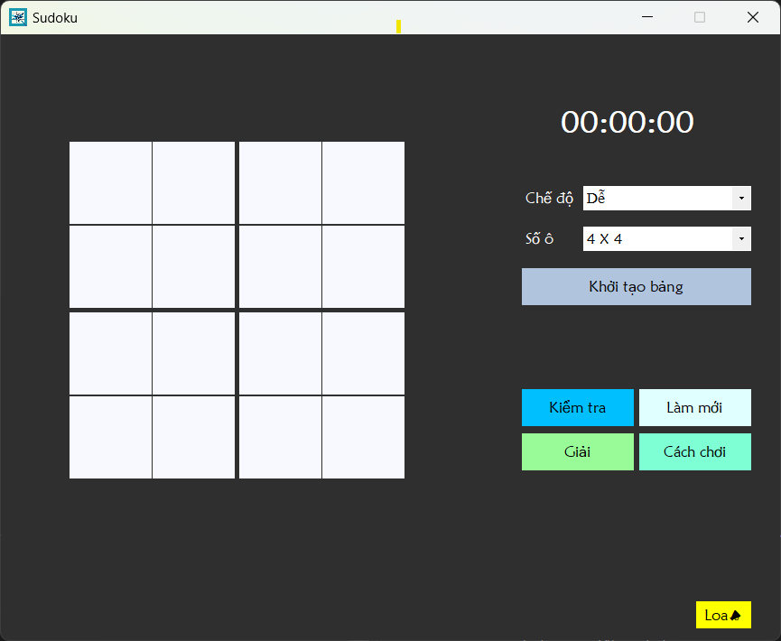
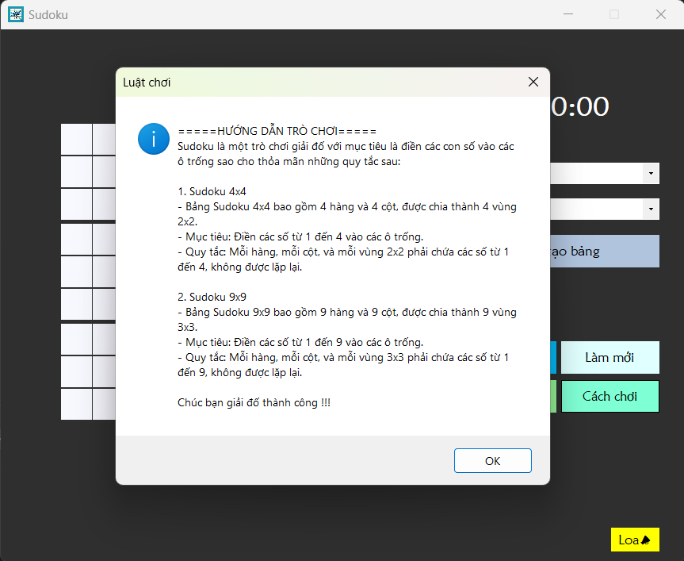
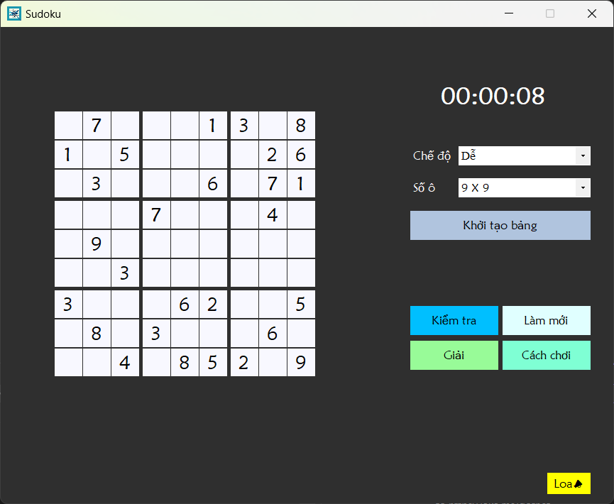
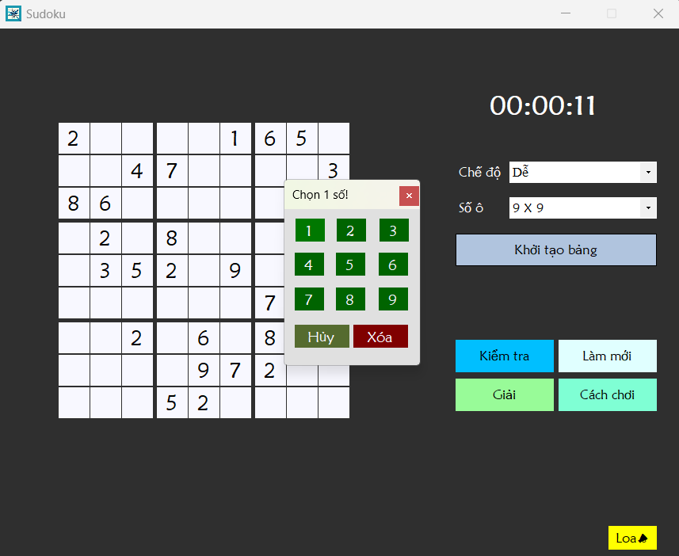
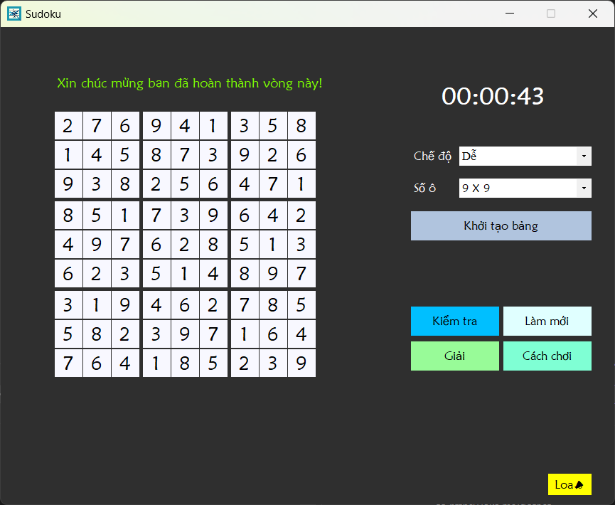

# 🧩 Sudoku Game Winform

## 1. Liên kết 
- Link nguồn tham khảo: [Truy cập Github](https://github.com/nayanbunny/Sudoku-CSharp).
- Link bảng chia việc nhóm: [Truy cập Google Sheets](https://docs.google.com/spreadsheets/d/1hnBnJ_pXnE0wcONNGLzlxvVDHWMVgxM2dVseIkLuvBE/edit?usp=sharing).

## 2. Giới thiệu
### 2.1. Game Sudoku
Sudoku là trò chơi giải đố logic nổi tiếng, thử thách người chơi bằng cách hoàn thành các ô số trong bảng 9x9 sao cho mỗi hàng, cột và vùng 3x3 chứa đủ các số từ 1 đến 9, không lặp lại. Đây là trò chơi phổ biến, giúp phát triển tư duy logic và khả năng tập trung.

### 2.2. Nhóm Chuồn Chuồn Con
Nhóm Chuồn Chuồn Con gồm có các thành viên:     

- Nguyễn Ngọc Phú Tỷ - Mã số sinh viên: 49.01.104.172 - Nhóm trưởng.
- Trần Lê Triều Dương - Mã số sinh viên: 49.01.104.026.
- Cao Võ Tuấn Kiệt - Mã số sinh viên: 49.01.104.076.
- Phan Thị Hồng Nhung - Mã số sinh viên: 49.01.104.104.

Đều là sinh viên năm hai đến từ khoa Công nghệ thông tin, trường Đại học Sư phạm Thành phố Hồ Chính Minh. 

### 2.3. Sản phẩm SudoKu Game Winform
Sudoku Game WinForm là một ứng dụng giải đố Sudoku đầy hấp dẫn và tương tác cao, được xây dựng trên nền tảng Windows Form bằng C#. Với giao diện trực quan, dễ sử dụng, ứng dụng này mang lại trải nghiệm giải đố nhẹ nhàng, gần gũi, đồng thời thử thách người chơi với nhiều mức độ, phù hợp cho cả người mới và những ai muốn nâng cao kỹ năng logic của mình.

Ứng dụng Sudoku Game WinForm được thiết kế với hai kích thước bàn cờ: 4x4 và 9x9, mang đến sự linh hoạt cho người chơi. Người chơi có thể chọn một trong ba chế độ chơi: dễ, trung bình và khó, phù hợp với mọi trình độ. Trải nghiệm chơi thêm phần sinh động với âm thanh thông báo khi thắng hoặc thua, cùng nhạc nền dễ chịu suốt quá trình chơi.

Ứng dụng còn tích hợp các chức năng hỗ trợ hữu ích:

- Kiểm tra: Xác định xem người chơi đã giải đúng hay chưa.
- Làm mới: Xóa các ô đã điền để bắt đầu lại.
- Giải: Tự động giải bài Sudoku hiện tại.
- Cách chơi: Hiển thị hướng dẫn chi tiết để người chơi dễ dàng làm quen với luật chơi.
- Loa: Cho phép bật hoặc tắt nhạc nền theo sở thích của người chơi.

## 3. Hình ảnh minh họa

### 3.1. Giao diện bàn cờ 4x4
<p align="center">  
  
</p>    

### 3.2. Giao diện bàn cờ 9x9 
<p align="center">  
  
</p>    

### 3.3. Hướng dẫn chơi
<p align="center">  
  
</p>  

### 3.4. Bắt đầu trò chơi với bàn cờ 9x9
<p align="center">  
  
</p>  

### 3.5. Bản chọn số cho từng ô
<p align="center">  
  
</p>  

### 3.6. Chiến thắng
<p align="center">  
  
</p>  

## 4. Cài đặt
### 4.1. Clone hoặc tải source từ repo
Để tải mã nguồn có thể dùng lệnh:
```shell
git clone https://github.com/tynnp/SudokuGameWinform
```

### 4.2. Mở project bằng Visual Studio 
Mở bằng Visual Studio với file `Sudoku.sln`.

### 4.3. Build và chạy ứng dụng
Build và chạy ứng dụng trực tiếp từ Visual Studio để bắt đầu trải nghiệm game!